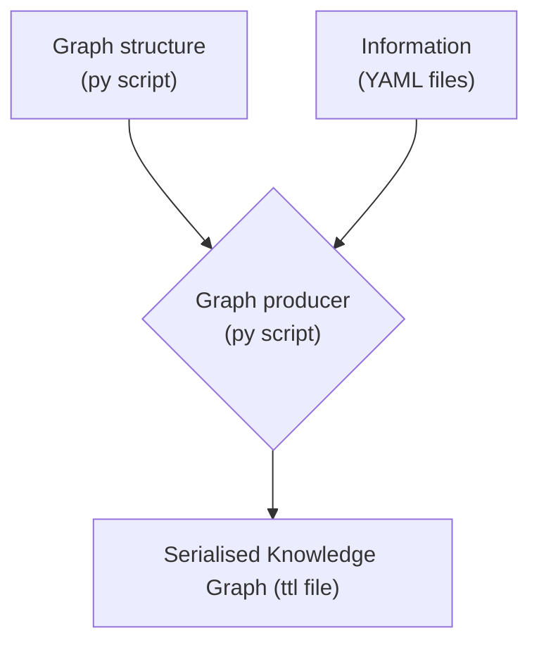
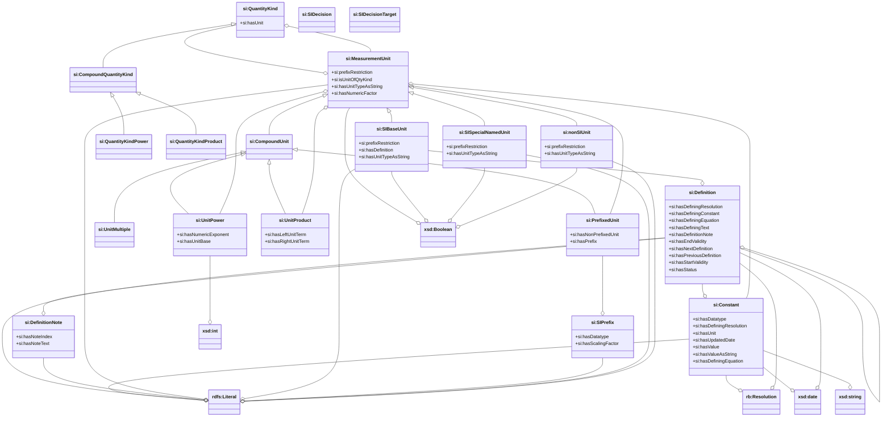

# Semantic SI
created: Jan 2023 / GD
last modified: 2026-03-27

This package implements the SI Reference point, a part of the SI digital framework. The package provides a 
machine-readable version (knowledge graph) of the units, prefixes, constants defined in the SI Brochure. 
The general workflow for the generation of the knowledge graph is:

See also SIDataModel.pdf (depicting the underlying data model used for this part of the SI digital framework 
\[may be obsolete on some aspects\]).
 
The package contains also a test Website (based on FastAPI), allowing to interrogate the produced knowledge graphs. 
Note that this is only provided for demo purposes. 

## Installation
Install as a python package

- Clone repository or download zip file and unzip it
- `pip install path/to/repo` (or `pip install -e path/to/repo` if you plan to edit the code and see the changes 
  immediately, "editable mode")

Python >= 3.11 required, for other requirements see pyproject.toml.

[Specific instructions for PyCharm](docs/pycharm.md)

## Command line usage
After installation, the `generate_sirp_files` is made available.

This command will create all `.ttl` and `.jsonld` files in a subfolder. The `-z` option generates a zip file of the ensemble.

For debugging purposes, you can choose to generate only one ttl by providing its label with the `--only` option.

`--gen_ontology_viz` updates the Markdown files in `docs/vocabulary_viz` using Ontospy. Make sure to add and commit 
changes if you want the up-to-date version to be displayed on GitHub.

`-o / --output_dir` indicates where to write the output files, and defaults to `./output`. Additionaly `--ttl_output_subdir` and `--jsonld_output_subdir` indicate the subdirectories for TTL and JSON-LD outputs. They default to `TTL` and `JSONLD`. 

`-h / --help` provides a list of available options.

### `launch_si_test_api`
This command will launch a local web-service for testing purposes.

## Short description of the `src/si_ref_point/` subdirectories

### tboxes

Contains the python scripts that will generate the "terminology" part of the SI Reference Point (`si_tbox.py`) and the additional concepts necessary to bond to responsible bodies (`rb_tbox.py`).

### aboxes

Contains the python scripts that will populate the "assertions" part of the SI Reference Point (constants, decisions, prefixes, quantities, units) and responsible bodies (CCTF, CGPM, CIPM). `symbols_format.py` is a common utility that handles the conversion between html, LaTeX, json and ascii formatting.

### inputs

Contains 2 subdirectories, `si` and `rb`, gathering all necessary input information. In general these are yaml files, but in the case for the SI concepts (that will feed the corresponding TBox) these are already ttl files.

Content of the `rb` directory originally come from a digitalization effort by Ron Tse (Ribose) in the frame of Metanorma (https://github.com/metanorma/cgpm-resolutions, https://github.com/metanorma/bipm-data-outcomes/tree/main)

### Test API
A fastapi instance allowing to test the TTL output used to be included in this package. It has now been transfered into a separate repo (sirp-tools).

## Current class diagram

