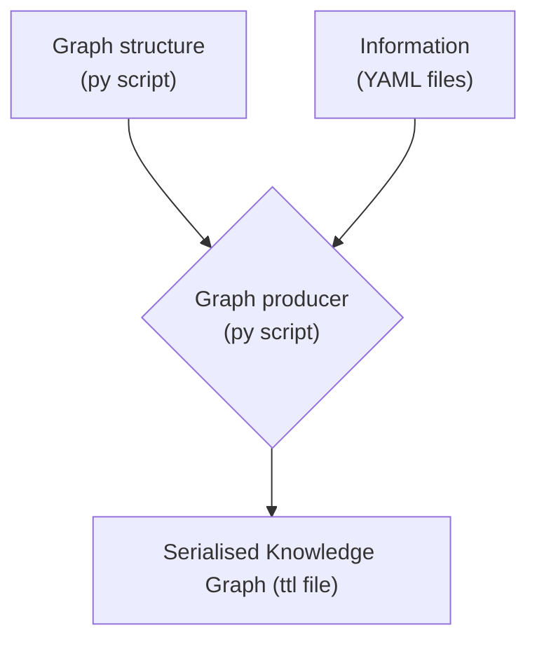

# Semantic SI
created: Jan 2023 / GD
last modified: 2023-11-07

This package implements the SI Reference point, a part of the SI digital framework. The package allows to produce a machine readable version of the SI Brochures (knowledge graph). 
General principle for the generation of the knowledge graphs :

See also SIDataModel.pdf (depicting the underlying data model used for this part of the si digital framework \[may be obsolete on some aspects\]).
 
The package contains also a test Website (based on FastAPI), allowing to interrogate the produced knowledge graphs. Note that this is only provided for demo purposes. 

## Installation
Install as a python package

- Clone repository or download zip file and unzip it
- `pip install path/to/repo` (or `pip install -e path/to/repo` if you plan to edit the code and see the changes immediately, "editable mode")

Python >= 3.11 required, for other requirements see pyproject.toml.

[Specific instructions for pycharm](./docs/install_in_pycharm.md)

## Usage
After installation, a `generate_turtle_files` command should be available and will create all `.ttl` files in a subfolder.

The `-z` option generates a zip file.

For debugging purposes, you can choose to generate only one ttl by providing its label with the `--only` option.

`--gen_ontology_viz` updates the markdown files in `docs/vocabulary_viz` using Ontospy. Make sure to add and commit changes if you want the up-to-date version to be displayed on github.

Finally `-o / --outputdir` indicates the directory where to output the ttl files. It defaults to `[package_dir]/TTL`. 

`-h / --help` provides a list of available options.

## Short description of the `src/si_ref_point/` sub directories

### cuq
Contains several Python codes that allow to produce 4 serialized knowledge graphs (as ttl) containing information about:
- the 7 constants underpinning the SI, 
- the Prefixes,
- the Quantities, 
- the Units.
The TBox (classes and properties) is common to all parts, the ABoxes (allowing to fill the knowledge graphs with individuals) are separate for the different parts. 
Each ABox gets the relevant information from one or more YAML file(s). The location of the input and output files is defined in settings.py

### cuq\_data
The YAML files containing all the input data, + turtle files for the SI ontology TBox (core + extended concepts).

### resbod
Contains Python code that allows to produce a serialized knowledge graph (as ttl file) of Responsible Bodies, their Events and the Outcomes thereof. 
The information is read from yaml files (provided by Ron Tse). The code is separated in TBox (definition of the classes and properties) and ABox (istances using TBox)
The location of the input and output files is defined in settings.py

### resbod\_data
Contains cctf, cgpm and cipm sub directories with yaml data for these 3 bodies, obtained from Ron Tse, see: https://github.com/metanorma/bipm-data-outcomes/tree/main) 

### Testing

The API can be launched with command `launch_si_test_api`. This is a refurbishment of the previous Testing/API code, now residing in `src/sir_ref_point/test_api` and not the production API. It is meant to allow quick tests of the requests.

## Current class diagram

