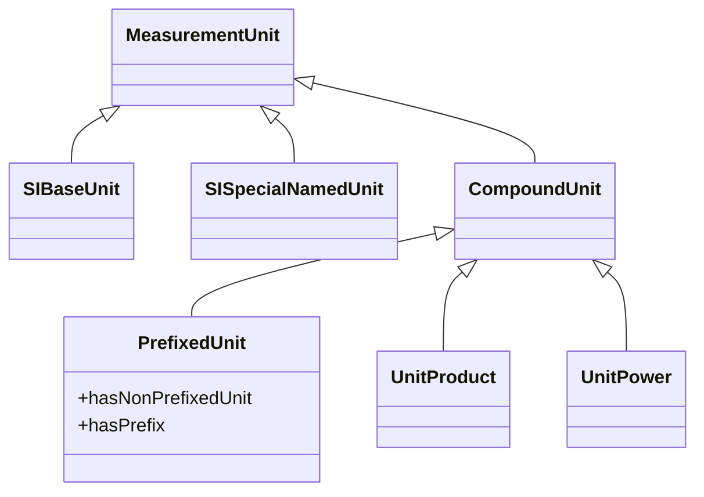

# The SI Reference Point

## Scope

The [SI Reference Point](http://62.161.69.201:8080/SI) is a set of tools making the information of the SI Brochures available in machine-readable form, designed to provide an authoritative digital reference for the [International System of Units (SI)](https://www.bipm.org/measurement-units/). The present document provides a general overview for users, with a more detailed description of the Application Programming Interface (API) given in Annex 1, and some examples of SPARQL queries provided in Annex 2 for illustrative purposes.

The present document is structured as follows:
*	Section 2 shows the information covered by the SI Reference Point.
*	Section 3 shows the data model used to encode the information.
*	Section 4 briefly indicates how the information can be browsed.
*	Annex 1 lists the pre-programmed (API) calls
*	Annex 2 gives further details about the SPARQL endpoint.

For a broader overview of the SI Digital Framework please see document BIPM-DIG-G01.

## Information contained in the SI Reference Point

The SI Reference Point comprises three main pillars (TTL files):
1. SI/units:
    * SI base units (Table 2 of [2])
    * SI derived units with special names (Table 4 of [2])
    * Non-SI units allowed for use with the SI (Table 8 of [2])
    * Compound units (the examples given in Tables 5 and 6 of [2] plus additional examples from the BIPM key comparison database (KCDB))
1. SI/prefixes:
    * SI prefixes (Table 7 of [2])
1. SI/decisions:
    * Decisions relating to the SI, taken by the CGPM and CIPM  (Appendix 1 of [2])
  
A tool is provided to allow for machine-encoding and interpretation of prefixed and other combined units (µm, m2, <nobr>m s-1, etc.).

The SI Reference Point relies on the following closely related components of the SI Digital Framework:

4. Constants
    * Initially the 7 defining constants of the SI (Table 1 of [2])
5.	Quantities
    * SI base quantities (Table 3 of [2])
    * Other example quantities (Tables 5 and 6 of [2])
    * Some other quantities in the BIPM key comparison database (KCDB))
6. Responsible bodies
    * CGPM, CIPM, etc.

  
Table. List of tables in the SI Brochure [2] and corresponding information in the SI Reference Point

| Table | Title | Encoded in|
| :----- | :----- | :---- |
| 1 |  The seven defining constants of the SI and the seven corresponding units they define  | constants |
| 2 | SI base units | SI/units |
| 3 |  Base quantities and dimensions  used in the SI | quantities |
| 4 |  The 22 SI units with special names and symbols | SI/units |
| 5 |  Examples of coherent derived units in the SI expressed in terms of base units | SI/units |
| 6 |  Examples of SI coherent derived units whose names and symbols include SI coherent derived units with special names and symbol | SI/units |
| 7 |  SI prefixes | SI/prefixes|
| 8 |  Non-SI units accepted for use with the SI units | SI/units |
| <nobr>Annex 1</nobr> |  Decisions of the CGPM and the CIPM | SI/decisions |

## Data model

The information contained in the nine editions of the SI Brochure has been encoded semantically and made publicly available on the internet at:

[si-digital-framework.org/SI](http://62.161.69.201:8080/SI) 

Figure 1 and Figure 2 show the data models developed for this purpose. Figure 1 shows the part covering measurement units.

The data model (classes and predicates) for prefixes:

Figure 2 the part covering the responsible bodies (letter e). The two models are connected through the classes Definition and Outcome. 

## Next steps

This beta version of the SI Reference Point is open for comment.

The list of kinds of quantity will gradually be extended to cover all the quantities included in the BIPM key comparison database (KCDB). To increase interoperability, authoritative external digital references for the listed quantities (such as from the ILV [4] or the IUPAC Gold Book [5]) should be built in. (Currently this has been done for only a few examples.) As the identification of appropriate external identifiers will have to be carried out by subject experts, these tasks will be carried out in collaboration with the CIPM’s Consultative Committees.

The current structure also allows for a possible future extension of the “constants” graph to provide the machine reference for a wider set of constants (for example, a machine-readable version of the “NIST Reference on Fundamental Physical Constants” [6]).

