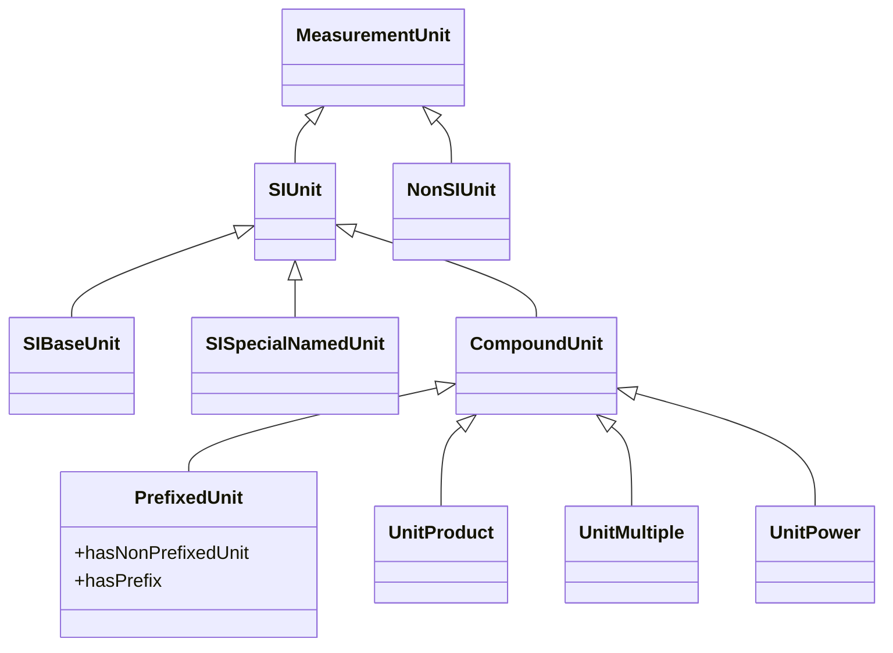

# The SI Reference Point

## Introduction

```mermaid
classDiagram
    MeasurementUnit <|-- SIUnit
    MeasurementUnit <|-- NonSIUnit
    SIUnit <|-- SIBaseUnit
    SIUnit <|-- SISpecialNamedUnit
    SIUnit <|-- CompoundUnit
    CompoundUnit <|-- PrefixedUnit
    CompoundUnit <|-- UnitProduct
    CompoundUnit <|-- UnitMultiple
    CompoundUnit <|-- UnitPower
    class PrefixedUnit{
      +hasNonPrefixedUnit
      +hasPrefix
    }
```
