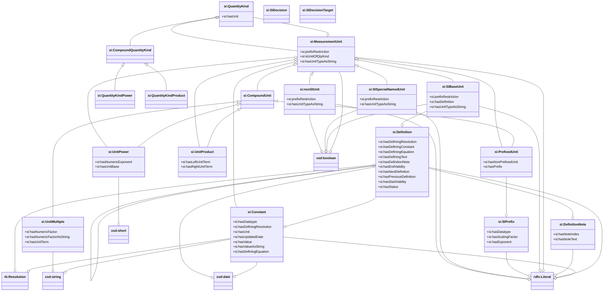
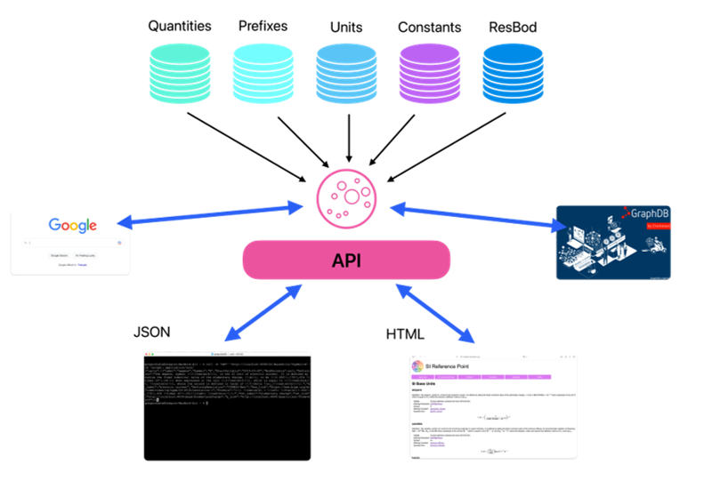
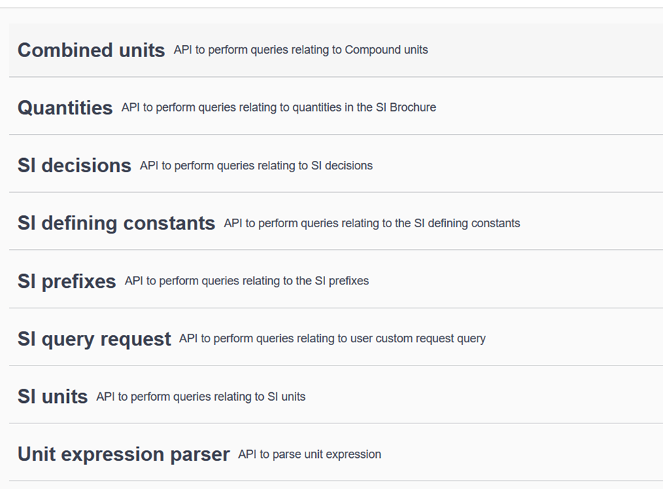
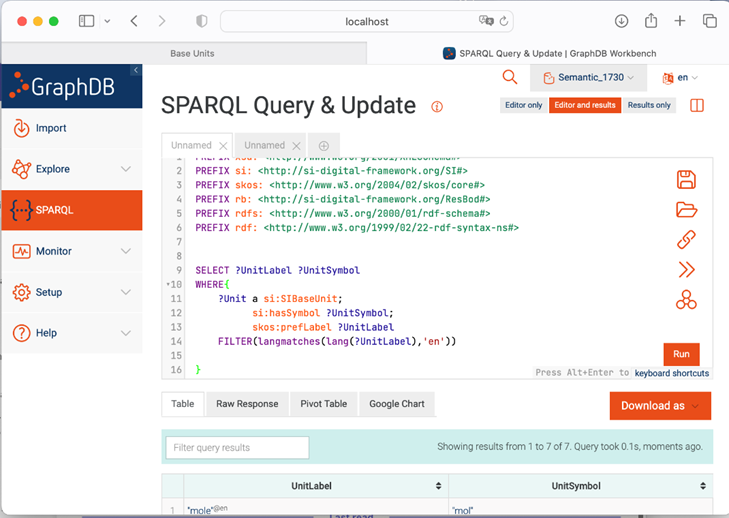

# The SI Reference Point

## 1. Scope

The [SI Reference Point](http://si-digital-framework.org/SI) is a part of the SI Digital Framework, an effort undertaken by the 
[International Committee for Weights and Measures](https://www.bipm.org/en/committees/ci/cipm) to digitalize metrology, endorsed by a growing coalition of international scientific and quality infrastructure organisations through a [Joint Statement of Intent](https://www.bipm.org/en/-/2022-03-30-digital-statement). The [SI Reference Point](http://si-digital-framework.org/SI) offers a suite 
of tools that render the information from the SI Brochures available in a machine-readable format and is thus at the 
very heart of the SI Digital Framework. It is designed to serve as the authoritative digital reference for the
[International System of Units (SI)](https://www.bipm.org/measurement-units/). 

The present document provides a general overview of the SI Reference Point for unsers who wish to utilize the 
information published by the BIPM. A more detailed description for advanced used cases, inclusing information for a 
local installation of the package, a description of the Application Programming Interface (API), and the underlying 
knowledge graph files is available separately. 

The present document is structured as follows:
*	Section 2 details the information covered by the SI Reference Point.
*	Section 3 shows the data model used to encode the information.
*	Section 4 indicates how the information can be browsed.
*	Annex 1 lists the Classes and Predicates in the data model.

## 2. Information contained in the SI Reference Point

#### Published information
The SI Reference Point is based on five main pillars, or knowledge graphs:
1. **[SI/units](http://si-digital-framework.org/SI/units)**
    * SI base units (Table 2 of [1])
    * SI derived units with special names (Table 4 of [1])
    * Non-SI units allowed for use with the SI (Table 8 of [1])
    * Compound units (the examples given in Tables 5 and 6 of [1] plus additional examples from the BIPM key 
      comparison database (KCDB) [2])
2. **[SI/prefixes](http://si-digital-framework.org/SI/prefixes)**
    * SI prefixes (Table 7 of [1])
3. **[Constants](http://si-digital-framework.org/constants)**
    * Initially the 7 defining constants of the SI (Table 1 of [1])
4.	**[Quantities](http://si-digital-framework,org/quantities)**
    * SI base quantities (Table 3 of [1])
    * Other example quantities (Tables 5 and 6 of [1])
    * Other quantities in the BIPM key comparison database (KCDB)
5. **[SI/decisions](http://si-digital-framework.org/SI/decisions)**
    * Decisions relating to the SI, taken by the [General Conference on Weights and Measures (CGPM)](https://www.bipm.org/en/committees/cg/cgpm) and the 
      [International Committee for Weights and Measures (CIPM)](https://www.bipm.org/en/committees/ci/cipm)  (Appendix 1 of [1])
  
##### Remarks
- The current version of the SI Reference Point covers exclusively the 7 defining constants of the SI. For a 
  comprehensive list of constants and their recommended values, consult [3].
- The SI/decisions information is presented in a stand-alone file, but interfaces with another component of the SI 
  Digital Framework under development, covering responsible bodies within the BIPM the (e.g., 
  [General Conference on Weights and Measures (CGPM)](https://www.bipm.org/en/committees/cg/cgpm) or the 
  [International Committee for Weights and Measures (CIPM)](https://www.bipm.org/en/committees/ci/cipm)).

  
**Table 1.** List of tables in the SI Brochure [1] and corresponding information in the SI Reference Point

| Table               | Title                                                                                                                         | Encoded in   |
|:--------------------|:------------------------------------------------------------------------------------------------------------------------------|:-------------|
| 1                   | The seven defining constants of the SI and the seven corresponding units they define                                          | constants    |
| 2                   | SI base units                                                                                                                 | SI/units     |
| 3                   | Base quantities and dimensions  used in the SI                                                                                | quantities   |
| 4                   | The 22 SI units with special names and symbols                                                                                | SI/units     |
| 5                   | Examples of coherent derived units in the SI expressed in terms of base units                                                 | SI/units     |
| 6                   | Examples of SI coherent derived units whose names and symbols include SI coherent derived units with special names and symbol | SI/units     |
| 7                   | SI prefixes                                                                                                                   | SI/prefixes  |
| 8                   | Non-SI units accepted for use with the SI units                                                                               | SI/units     |
| <nobr>App. 1</nobr> | Decisions of the CGPM and the CIPM                                                                                            | SI/decisions |

#### Tools
The SI Reference Point provides also a tool to allow for machine-encoding and interpretation of prefixed and other 
combined units (µm, m2, <nobr>m s-1, etc.).

--> !! USAGE !! <---

## 3. Data model

The information contained in the ninth edition of the SI Brochure has been encoded semantically and made publicly 
available on the internet at:

[si-digital-framework.org/SI](http://si-digital-framework.org/SI) 

The figure below shows the data model developed for this purpose. For a full list of the classes and predicates please 
refer to the GitHub site (see Annex 1).

## 4. Browsing the knowledge graphs

### General
The set of knowledge graphs are presented in the form of TTL files, which can be browsed by different means as outlined 
below. As they are interlinked, the five TTL files should be available together for parsing by the chosen application. 
The information can then be displayed and exploited according to the services offered by the application.

Following standard practice, the TTL files are divided between a “T-box”, specifying the data model at the “SI” level, 
and “A-boxes”, specifying the data entries at the “units”, “prefixes” and “decisions” levels.

### Application Programming Interface (API)

The web interface at https://si-digital-framework.org/SI is designed to simplify access to the knowledge graphs for a 
human reader. Underpinning the web pages are a set of pre-programmed calls to the TTL files, such as (expressed as words 
rather than data requests): “list all the SI units”, “list all the SI prefixes”, 
“what is the current definition of the metre”, etc. 

The same pre-programmed queries (API calls) are documented in the Swagger interface at
[https://si-digital-framework.org/api-docs/swagger-ui](https://si-digital-framework.org/api-docs/swagger-ui)

Select the service `SI REFERENCE POINT` from the drop-down menu at the top right of the screen.

The responses will be given according to the header information, which can be modified manually from a Command Line 
Interface if desired. For example: 
* `-H ‘accept:application/json’` will return JSON code
* `-H ‘accept:application/xml’`	will return XML code
* `-H ‘accept:application/octet-stream’` will return the response without change of format (i.e. in TTL)
 

### SPARQL endpoint

The TTL files can also be interrogated directly either using the [SPARQL endpoint](http://si-digital-framework.org/SI/query?lang=en) provided or via a human-friendly
tool such as GraphDB. 

As an example, to browse the files visually using GraphDB:
* Download the (free) (GraphDB Desktop software)[https://www.ontotext.com/products/graphdb/] and install it on your computer.
* Create a new repository, e.g. SI-MMDD, based on:

  * PREFIX skos: <http://www.w3.org/2004/02/skos/core#>
  * PREFIX si: <https://si-digital-framework.org/SI#>   
  * PREFIX units: <https://si-digital-framework.org/SI/units/>
  * PREFIX prefixes: <https://si-digital-framework.org/SI/prefixes/>
  * PREFIX decisions: <https://si-digital-framework.org/SI/decisions/>
  * PREFIX constants: <https://si-digital-framework.org/constants/>
  * PREFIX quantities: <https://si-digital-framework.org/quantities/>

GraphDB also provides an interface for visual exploration of the knowledge graphs.

## References
[1] Le système international d'unité (SI), 9e édition, V2.01 (2022), ISBN 978-92-822-2272-0
[2] https://www.bipm.org/kcdb/
[3] https://pml.nist.gov/cuu/Constants/

### Acknowlegements

This project was undertaken as part of the BIPM's Work Programme in Digital Transformation, with contributions 
from seconding NMIs.

The BIPM thanks in particular the following colleagues (listed alphabetically),
who all made invaluable contributions:

* Amin Ben Abdallah
* Stuart Chalk (UNF)
* Gregor Dudle (METAS, now OST)
* Maximilian Gruber (PTB)
* Jean-Laurent Hippolyte (NPL)
* Frédéric Meynadier (BIPM)
* Janet Miles (BIPM, now OIML)

## Annex 1:	List of Namespaces, Classes and Predicates

A complete list of Classes and Predicates contained in the knowledge graphs 
* SI/units.ttl
* SI/prefixes.ttl
* SI/decisions.ttl
* constants.ttl
* quantities.ttl

will soon be available.

### Namespaces

#### ~bodies
* https://si-digital-framework.org/bodies#
* https://si-digital-framework.org/bodies/CGPM#
* https://si-digital-framework.org/bodies/CIPM#
* https://si-digital-framework.org/bodies/CCTF#
* https://si-digital-framework.org/bodies/AUV#		(not yet implemented)
* https://si-digital-framework.org/bodies/CCEM#		(not yet implemented)
* https://si-digital-framework.org/bodies/CCL#		(not yet implemented)
* https://si-digital-framework.org/bodies/CCM#		(not yet implemented)
* https://si-digital-framework.org/bodies/CCPR#		(not yet implemented)
* https://si-digital-framework.org/bodies/CCT#		(not yet implemented)
* https://si-digital-framework.org/bodies/CCQM#		(not yet implemented)
* https://si-digital-framework.org/bodies/CCU#		(not yet implemented)

#### ~constants
* https://si-digital-framework.org/constants#

#### ~kcdb
* https://si-digital-framework.org/kcdb-sc#
* https://si-digital-framework.org/kcdb-cmc#

#### ~quantities
* https://si-digital-framework.org/quantities#

#### ~SI
* https://si-digital-framework.org/SI#
* https://si-digital-framework.org/SI/decisions#
* https://si-digital-framework.org/SI/prefixes#
* https://si-digital-framework.org/SI/units#

### Classes and Predicates
TODO: ???