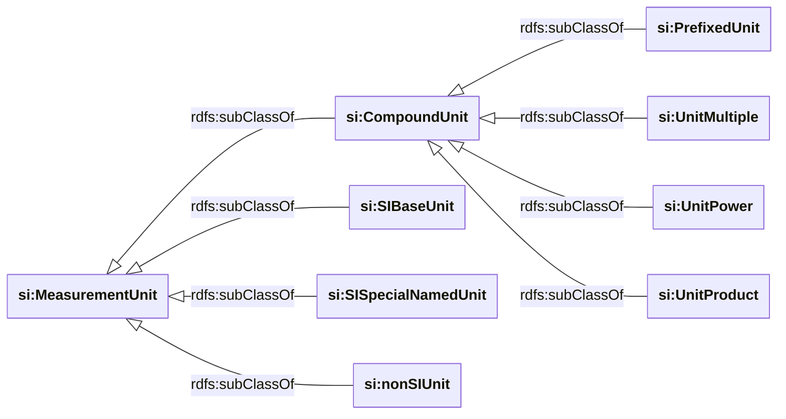
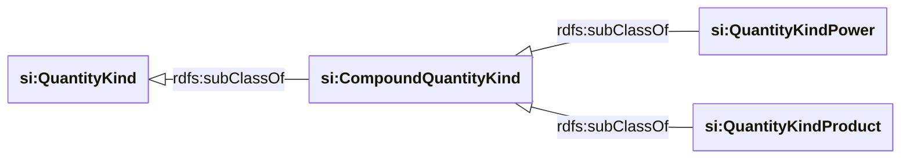
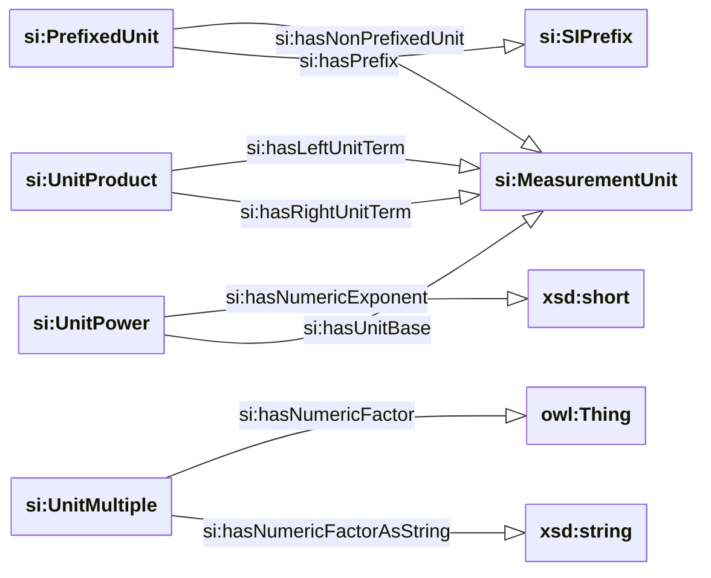
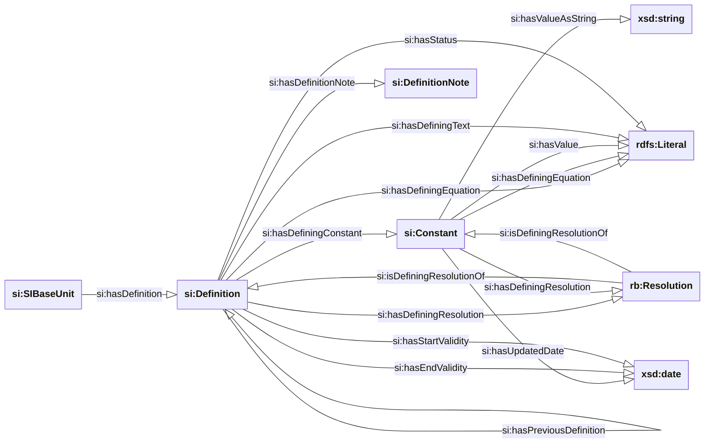

# Diagrams
## Unit-related Concepts

```mermaid
%%{init: { 'class': {'hideEmptyMembersBox':true} } }%%
classDiagram
direction RL
`si:CompoundUnit` --|> `si:MeasurementUnit` : rdfs#colon;subClassOf
`si:PrefixedUnit` --|> `si:CompoundUnit` : rdfs#colon;subClassOf
`si:SIBaseUnit` --|> `si:MeasurementUnit` : rdfs#colon;subClassOf
`si:SISpecialNamedUnit` --|> `si:MeasurementUnit` : rdfs#colon;subClassOf
`si:UnitMultiple` --|> `si:CompoundUnit` : rdfs#colon;subClassOf
`si:UnitPower` --|> `si:CompoundUnit` : rdfs#colon;subClassOf
`si:UnitProduct` --|> `si:CompoundUnit` : rdfs#colon;subClassOf
`si:nonSIUnit` --|> `si:MeasurementUnit` : rdfs#colon;subClassOf
```
## QuantityKind-related Concepts

```mermaid
%%{init: { 'class': {'hideEmptyMembersBox':true} } }%%
classDiagram
direction RL
`si:CompoundQuantityKind` --|> `si:QuantityKind` : rdfs#colon;subClassOf
`si:QuantityKindPower` --|> `si:CompoundQuantityKind` : rdfs#colon;subClassOf
`si:QuantityKindProduct` --|> `si:CompoundQuantityKind` : rdfs#colon;subClassOf
```
## CompoundUnit-related properties

```mermaid
%%{init: { 'class': {'hideEmptyMembersBox':true} } }%%
classDiagram
direction LR
`si:PrefixedUnit` --|> `si:MeasurementUnit` : si#colon;hasNonPrefixedUnit
`si:PrefixedUnit` --|> `si:SIPrefix` : si#colon;hasPrefix
`si:UnitMultiple` --|> `owl:Thing` : si#colon;hasNumericFactor
`si:UnitMultiple` --|> `xsd:string` : si#colon;hasNumericFactorAsString
`si:UnitPower` --|> `xsd:short` : si#colon;hasNumericExponent
`si:UnitPower` --|> `si:MeasurementUnit` : si#colon;hasUnitBase
`si:UnitProduct` --|> `si:MeasurementUnit` : si#colon;hasLeftUnitTerm
`si:UnitProduct` --|> `si:MeasurementUnit` : si#colon;hasRightUnitTerm
```
## Definition-related properties

```mermaid
%%{init: { 'class': {'hideEmptyMembersBox':true} } }%%
classDiagram
direction LR
`si:Definition` --|> `si:Constant` : si#colon;hasDefiningConstant
`rb:Resolution` --|> `si:Definition` : si#colon;isDefiningResolutionOf
`rb:Resolution` --|> `si:Constant` : si#colon;isDefiningResolutionOf
`si:Definition` --|> `rdfs:Literal` : si#colon;hasDefiningEquation
`si:Constant` --|> `rdfs:Literal` : si#colon;hasDefiningEquation
`si:Constant` --|> `xsd:date` : si#colon;hasUpdatedDate
`si:Constant` --|> `rdfs:Literal` : si#colon;hasValue
`si:Constant` --|> `xsd:string` : si#colon;hasValueAsString
`si:Definition` --|> `rb:Resolution` : si#colon;hasDefiningResolution
`si:Constant` --|> `rb:Resolution` : si#colon;hasDefiningResolution
`si:SIBaseUnit` --|> `si:Definition` : si#colon;hasDefinition
`si:Definition` --|> `si:Definition` : si#colon;hasNextDefinition
`si:Definition` --|> `si:Definition` : si#colon;hasPreviousDefinition
`si:Definition` --|> `rdfs:Literal` : si#colon;hasDefiningText
`si:Definition` --|> `si:DefinitionNote` : si#colon;hasDefinitionNote
`si:Definition` --|> `xsd:date` : si#colon;hasEndValidity
`si:Definition` --|> `rdfs:Literal` : si#colon;hasStatus
`si:Definition` --|> `xsd:date` : si#colon;hasStartValidity
```
